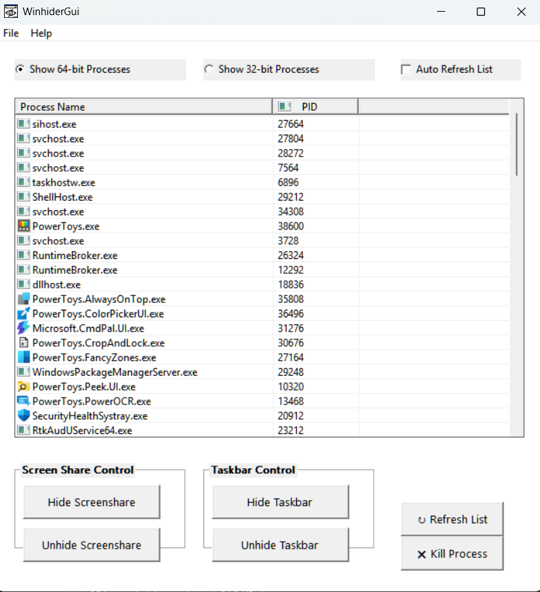
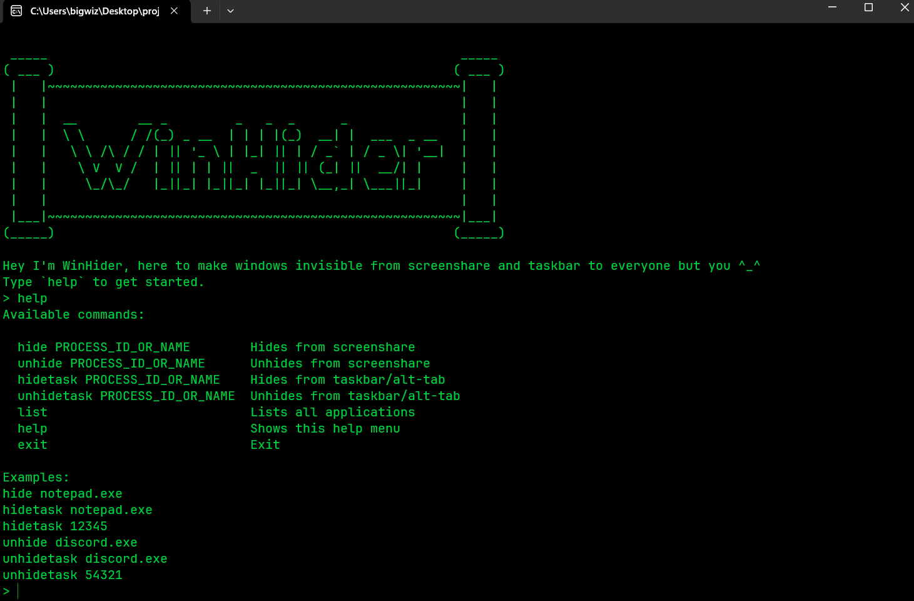
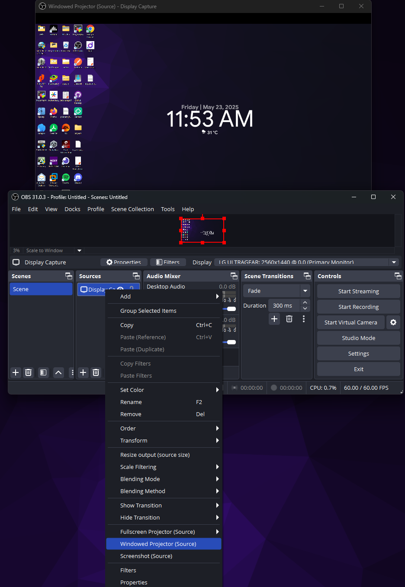

# WinHider


[](https://github.com/aamitn/winhider/actions/workflows/build.yml)

`WinHider` (short for _`Window Hider`_) is an application that allows you to hide user defined windows from screensharing (zoom, ms-teams, gmeet etc.) and also from taskbar / taskswitcher (Alt-Tab)

Original Fork From : [`https://github.com/radiantly/invisiwind`](https://github.com/radiantly/invisiwind)

## Glimpse of the GUI and CLI
<p float="left">
  
  
</p>

## What does it do exactly?

I think this is best explained with the video illustration below:


The above GIF illustrates how I used WinHider to hide the Notepad window from my screenshare and taskbar/taskswitcher while still being able to see it on my end. This is useful when you want to share your screen but don't want the other participants to see the Screensharing window itself.

### What goes under the hood? 

The tool performs dll injection with dlls containg targets for :
- [SetWindowDisplayAffinity](https://docs.microsoft.com/en-us/windows/win32/api/winuser/nf-winuser-setwindowdisplayaffinity) to `WDA_EXCLUDEFROMCAPTURE`. (For hiding from screenshare)
- Modifying the window’s [extended styles](https://learn.microsoft.com/en-us/windows/win32/winmsg/extended-window-styles) (For hiding from taskbar & taskswitcher) : 
  1. It removes the [`WS_EX_APPWINDOW`](https://learn.microsoft.com/en-us/previous-versions/dd425531(v=vs.100)) style, which normally causes a window to appear in the taskbar and Alt-Tab.
  2. It adds the [`WS_EX_TOOLWINDOW`](https://learn.microsoft.com/en-us/previous-versions/dd410943(v%3Dvs.100)) style, which hides the window from the taskbar and Alt-Tab.

## 📦 Directory Structure

- `Hide`, `Unhide` – Dlls for hiding/unhiding from screenshare
- `HideTask`, `UnhideTask` –  Dlls for hiding/unhiding from taskbar/taskswitcher
- `Injector` – CLI and DLL Injector code
- `WinhiderGui` – WinAPI GUI code
- `Misc` – Miscellaneous files (icons, images, etc.)
- `build.ps1` – PowerShell script to build the project with MSBUILD`
- `sign.cmd` – Command-line script to sign the release binaries and installer

## How do I install it?

To use this application, you can either use the installer or the portable version.

> :
**Binaries Legend**   
`Winhider.exe` -> 64-bit CLI   
`Winhider_32bit.exe` -> 32-bit CLI    
`WinhiderGui.exe` -> 64-bit GUI  
`WinhiderGui_32bit.exe` -> 32-bit GUI 
`hide_hotkey.exe` -> Auto Hotkey Handler(32-bit only)
>

### Use the binary installer (recommended)

 - Download and run [`WinhiderInstaller.exe`](https://github.com/radiantly/Winhider/releases/download/latest/WinhiderInstaller.exe).
 - Once the installation is complete, you will be able to run `Winhider` from the Start Menu.

### Download the portable zip with prebuilt binaries

- Download and extract the generated zip bundle named [`Winhider.zip`](https://github.com/aamitn/Winhider/releases/download/latest/Winhider.zip).
- Run `Winhider.exe`. You will now be dropped into a terminal.
- Running the `CLI binary(Winhider.exe)`  directly drops you into interactive mode. You can type `help` for more information.
- Running the `GUI binary(WinhiderGui.exe)`  starts the wrapper GUI head to Help->About for more information.
>You can also directly invoke it with commandline arguments. Type `Winhider --help` for argument specification.


### Build The Project 

- Download and extract the source from [here](https://github.com/aamitn/Winhider).
  ```bash
  git clone https://github.com/aamitn/Winhider
  cd Winhider
  ```
- If you have Visual Studio Installed, open the Winhider.sln and build as per provided configs.

- Alternatively you can run `build.ps1` in powershell to buiild from CLI without IDE
> To build without IDE form CLI using powershell script, make sure you have [Visual Studio Build Tools](https://aka.ms/vs/17/release/vs_BuildTools.exe) installed , you may skip this if you have entire Visual Studio Installation at system. 

### Sign Release Binaries
- Use `sign.cmd` to sign the release binaries and installer. This is optional but recommended for distribution. This script signs `.exe` and `.dll` files using `signtool.exe` and a `.pfx` certificate.
- Our provided signing certificate is in `.pfx` format is at [`./Misc/WinHider.pfx`](https://#).
- 🔐 **Default Behavior:** Running without arguments signs all `.exe` and `.dll` files in `Build\bin\Release` using the default password
- ⚙️ Arguments

	| Argument                     | Description                                                                      |
	|-----------------------------|----------------------------------------------------------------------------------|
	| `--pass "<password>"`<br>`-p "<password>"` | Use custom password for signing (quotes required)              |
	| `--signinstaller`<br>`-i`    | Sign only installer `.exe` files in `Misc\output`                               |
	| `--signall`<br>`-a`          | Sign both main binaries and installer files                                     |
	| `--help`<br>`-h`             | Show help message                                                               |
- 🔗 **Timestamp Server:**  `http://timestamp.comodoca.com/authenticode` (Uses Comodo’s timestamp server)
> ⚠️ **Important:** Password must be enclosed in quotes. Avoid hardcoding passwords—pass them securely using environment variables or CI/CD secrets.

## FAQs

#### What OSes are supported?

Microsoft Windows 10 v2004 or above. On previous versions of windows, a black screen shows up instead of hiding the window.

#### Do future instances of the application get automatically hidden?

No

#### Is it possible to see a preview of the screen on my side?
- You can simply use [`OBS Studio`](obsproject.com/download) with Windowed Projectors.
- Open OBS and do first-time setup.
- Then Right-Click under Sources-> Add-> Display Capture->OK-> Select Monitor under `Display` Dropdown-> OK. Now you will see infinity mirror if you have single diplay.
- Right click on the newly creted display under sources -> Click Windowed Projector.
- Minimize OBS and check for window hide status in projector window
- Multi-Monitor Systems will not require additional projector
<details>
<summary>Expand for Screenshot</summary>



_Tip: you can hide the Projector window from view too._

</details>

#### Could I automatically hide windows using a hotkey?

Yes! with the installer and zip-bundles we provide 2 ways to achieve this : 
- An Autohotkey(.ahk) script named `hide_hotkey.ahk` which could be run using Autohotkey v2+
- If you dont have Autohotkey installed in your system, you could also use the precompiled `hide_hotkey.exe` to use hotkey functions
	> :
	**Hotkey Legend**  
	`Ctrl+H` -> Hide from Screenshare   
	`Ctrl+J` -> Unhide from Screenshare   
	`Ctrl+K` -> Hide from Screenshare   
	`Ctrl+L` -> Hide from Screenshare   
	`Ctrl+Q` -> Exit/Quit Hotkey Script
	 >

## Contributing

Feel free to open an [`issue`](https://github.com/aamitn/winhider/issues/new) / [`PR`](https://github.com/aamitn/winhider/compare) if you find a bug or would like to contribute!
